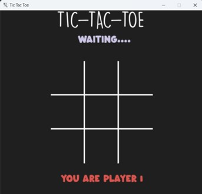
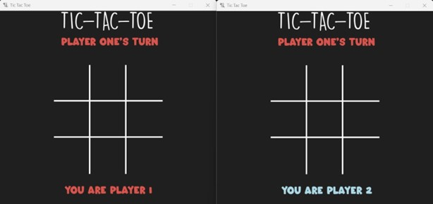
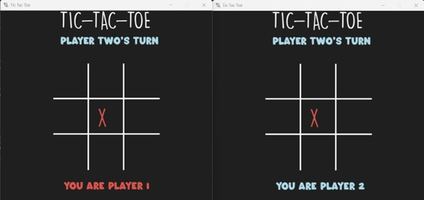
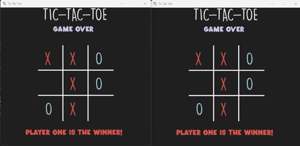

# Multiplayer Tic-Tac-Toe Game Using Socket Programming

This is a multiplayer Tic-Tac-Toe game implemented using socket programming in Python. The game allows two players on different devices within the same network to connect and play against each other.

## How to Play

1. **Start the Server:**
   - Run `server.py` on the machine that will act as the server.
   - The server's IP address will be displayed in the terminal.
   - The default port number is set in `server.py`, but it can be configured if needed.

2. **Connect Clients:**
   - On any other machine, run `client.py`.
   - Enter the IP address of the server (as displayed in the server terminal) when prompted.
   - The client will connect to the server and wait for another player to join.

3. **Game Start:**
   - Once both players are connected, the game will start automatically.
   - Players take turns to place their mark (X or O) on the Tic-Tac-Toe board.
   - The game continues until one player wins or the board is full (resulting in a draw).

## Configuration

- The IP address and port number can be configured in `server.py` as per your network setup.
- Ensure that both `server.py` and `client.py` are in the same directory.

## Screenshots

### 1. Waiting for Second Player


### 2. Both Players Connected


### 3. Game in Progress


### 4. Game Over


## Requirements

- Python 3.x
- Tkinter (for GUI)
- Pygame (for enhanced game visuals)

## Running the Game

1. Clone the repository:

   ```bash
   git clone https://github.com/yourusername/tictactoe-multiplayer.git
   cd tictactoe-multiplayer
   ```

2. Install the required libraries:

   ```bash
   pip install -r requirements.txt
   ```

3. Start the server:

   ```bash
   python server.py
   ```

4. Connect clients:

   ```bash
   python client.py
   ```

5. Enter the server's IP address on each client to connect and start playing!
